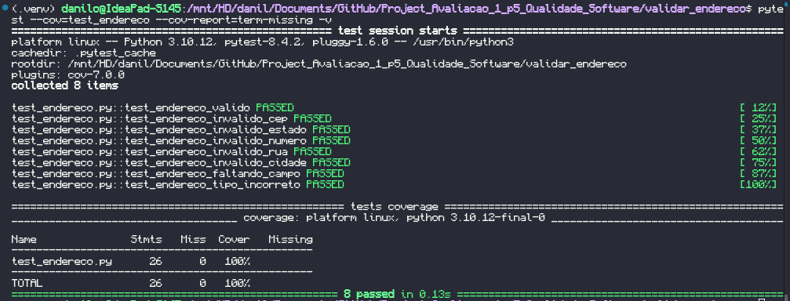

# Projeto: Validador de Endereço

Este projeto implementa um **validador de endereços** em Python, verificando se os dados fornecidos seguem um formato válido e completo.

Além disso, o projeto conta com **testes automatizados** escritos com `pytest`, e um relatório de cobertura gerado com `pytest-cov`.

---

## Estrutura do Projeto

```
validar_endereco/
├─ endereco.py
└─ test_endereco.py

```

---

## Como Executar

### 1. Instalar as dependências

```bash
pip install pytest pytest-cov
```

### 2. Executar os testes

```bash
pytest -v
```

### 3. Executar com relatório de cobertura

```bash
pytest --cov=test_endereco --cov-report=term-missing -v
```

---

## Regras de Negócio Testadas

1. Endereço válido (completo e formatado corretamente)

  - Todos os campos obrigatórios estão presentes (`rua, numero, cidade, estado, cep`).
  - Cada campo segue o padrão esperado.
  - Resultado esperado: válido (`True`).

2. CEP inválido

O formato do CEP deve ser `00000-000` ou `00000000`.
Qualquer CEP com número incorreto de dígitos ou hífen no local errado é inválido.
Exemplo testado: `"0131-100"` → `inválido`.

3. Estado inválido

  - O campo estado deve conter exatamente duas letras (*UF*).
  - Exemplo testado: `Sao Paulo` → `inválido`.
  - Exemplo válido: `SP`.

4. Número inválido

  - O campo numero deve conter apenas números e, opcionalmente, uma letra no final (ex: `100A`).
  - Qualquer número com letras no meio é inválido.
  - Exemplo testado: `10A0` → `inválido`.

5. Rua inválida

  - O campo rua deve conter apenas letras e espaços, com pelo menos 3 caracteres.
  - Exemplo testado: `Av` → `inválido`.

6. Cidade inválida

  - O campo cidade deve conter apenas letras e espaços, com pelo menos 2 caracteres.
  -Exemplo testado: `"S"` → `inválido`

7. Faltando campo obrigatório

  - O endereço deve conter todos os campos esperados (`rua, numero, cidade, estado, cep`).
  - A ausência de qualquer um torna o endereço inválido.
  - Exemplo testado: endereço sem `"estado"` → `inválido`

8. Tipo incorreto de dados

  - O endereço deve ser um dicionário.
  - Outros tipos (como list, tuple, str) são inválidos.
  - Exemplo testado: lista com chaves e valores → `inválido`.

---

## 🧪 Exemplo de Execução de Testes

```bash
pytest --cov=endereco --cov-report=term-missing -v
```

### Saída esperada:

## Relatório de Cobertura

Abaixo print do relatório de cobertura:



---

## Autor

**Danilo Pereira**
Projeto desenvolvido para fins acadêmicos na disciplina de **Qualidade de Software**.
